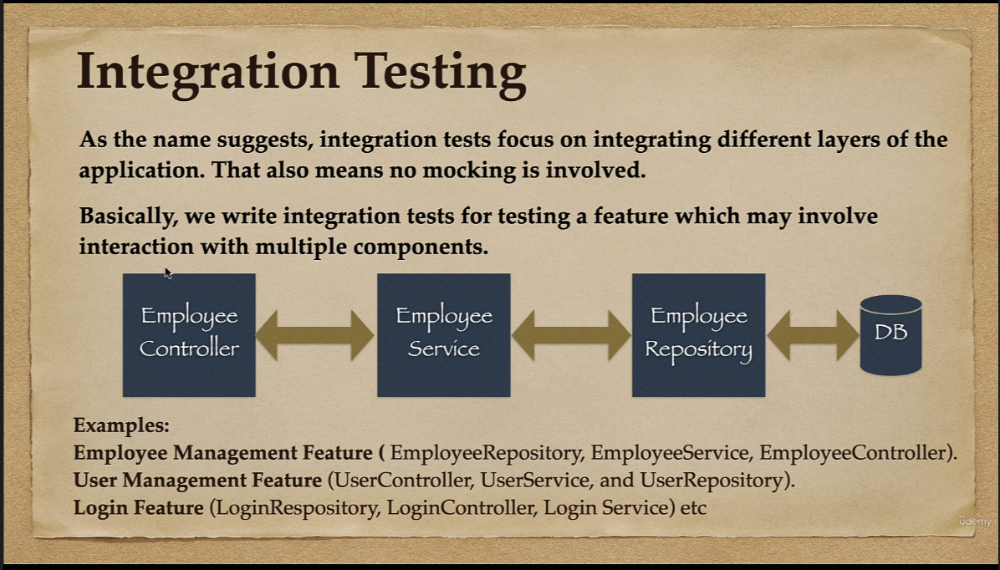
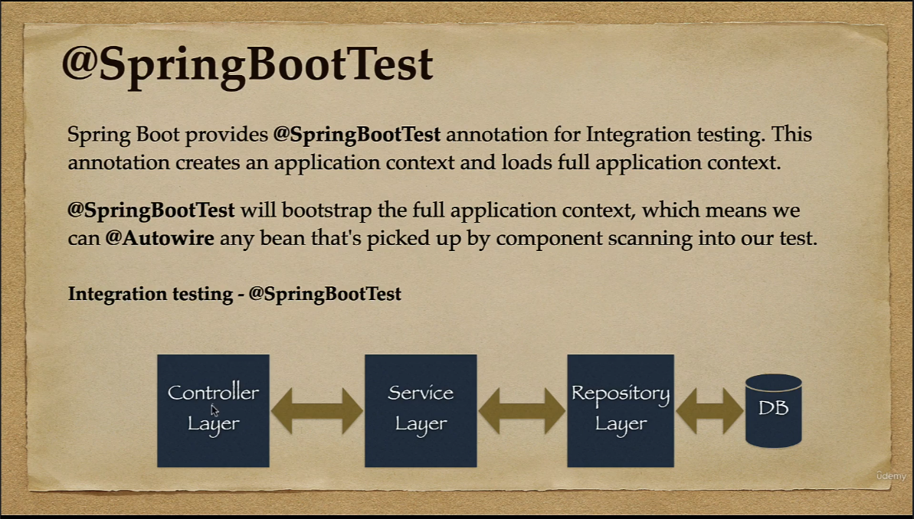
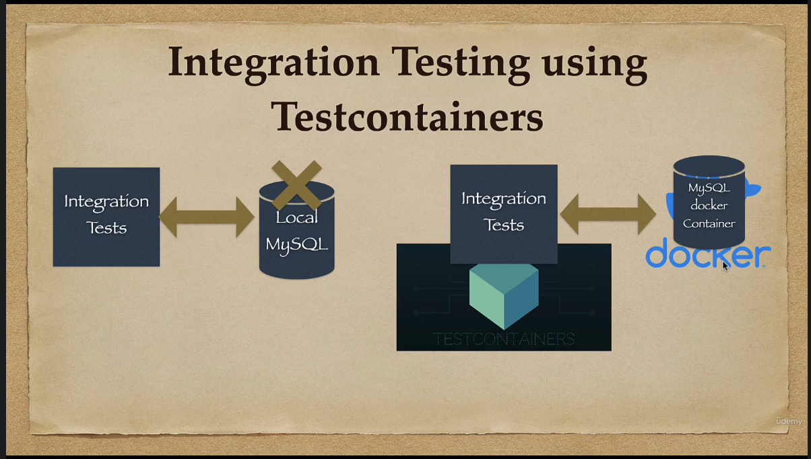
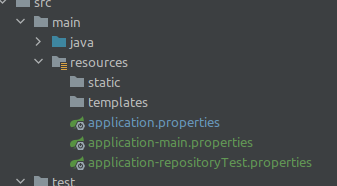
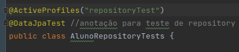

## Do curso de Testing da Udemy
### ministrado por Java Guides

### Testes de integração
Os testes de integração são focados em, como o nome sugere, testar a relação entre diferentes camadas da aplicação que sejam dependentes entre si. Qual seja: não se utiliza de Mock em tais testes.

Os Unit testes são utilizados para testar as camadas uma a uma, o Integration Test é utilizado para testar o fluxo completo da aplicação.

A anotação utilizada em testes de integração é a *@SpringBootTest*.



Os testes são utilizados conforme o FEATURE que se deseja testar. Cada feature envolvendo a integração de componentes múltimos: E.g.: <br> 
**Gerenciamento de Aluno**: AlunoRepository, AlunoService, AlunoController. <br>
**Login**: LoginRepository, LoginService, LoginController. <br>
**Gerenciamento de Usuário**: UsuarioRepository, UsuarioService, UsuarioController.


### @SpringBootTest

Anotação que cria e carrega todo contexto da aplicação. 

A anotação carrega todos os Beans de todas as camadas da aplicação, permitindo que possamos realizar o teste de integração.

Por trás dos panos, o *@SpringBootTest* inicia o servidor, cria o ambiente Web e habilita a anotação *@Test* a realizar os testes de integração.



Por padrão, a anotação *@SpringBootTest* **não inicia o servidor**. Precisamos configurar o webEnvironment para que seja determinado em que contexto o teste será executado.

Para tal, temos diversas opções:

MOCK(default): Carrega um web ApplicationContext e disponibiliza um Mock de um ambiente web. <br>
RANDOM_PORT: Carrega o WebServerApplicationContext e disponibiliza um ambiente web real. O servidor embutido é iniciado em uma porta aleatória. **Esta é a opção que deve ser utilizada em testes de integração.**<br>
DEFINED_PORT: Carrega o WebServerApplicationContext e disponibiliza um ambiente web real. <br>
NONE: Carrega o ApplicationContext por meio do SpringApplication, mas não disponibiliza ambiente web algum.

### Teste de Integração da camada Repository
Por que testar a camada repository novamente?

A anotação *@DataJpaTest*, do Unit teste que já realizamos, utiliza uma base H2 em memória. 
Para testarmos nosso código em condições de produção, utilizamos o teste de integração da camada repository.

Nosso interesse é saber se nosso código está funcional em condições de produção -- acesso à base real.

Fazemos isso desabilitando o suporte da base em memória e habilitando o suporte para base de produção (no nosso caso, MySQL).

Assim, em vez de aportarmos nossos testes para a base H2 em memória, apontamos para a base real das condições de produção.


### Teste de Integração com Testcontainers
Um problema comum com os testes de integração é a questão da configuração das dependências. Ex.: precisa-se instalar a versão específica do MySQL etc.

Testcontainers são uma biblioteca Java com suporte para testes JUnit, com bancos de dados embutidos, Selenium web browsers, e tudo mais que se pode rodar num container Docker.

A biblioteca permite que realizemos testes sem a necessidade de componentes previamente instalados. 

Com os Testcontainers, sempre iniciamos uma base de dados do zero, permitindo que nossos testes rodem em qualquer máquina.

Com os Testcontainers, eliminamos a necessidade de instalações locais, conforme imagem a seguir:



## @ActiveProfiles e application-perfil.properties

O AlunoRepositoryTest precisa rodar em base H2, sem dialeto
configurado. Para isso, precisamos criar um novo perfil
de propriedades:



* Em application.properties, indicamos o perfil que está sendo utilizado:

```properties
spring.profiles.active=main
```

Aqui podemos alterar de main para repositoryTest, conforme propriedades que desejamos utilizar.

* Em application-main.properties, indicamos as configurações do perfil main:

```properties
spring.jpa.show-sql=true

spring.datasource.url=jdbc:mysql://localhost:3306/ams?allowPublicKeyRetrieval=true&useSSL=false
#  ams=alunoManagementeSystem
spring.datasource.username=root
spring.datasource.password=root

spring.jpa.properties.hibernate.dialect=org.hibernate.dialect.MySQL5InnoDBDialect

spring.jpa.hibernate.ddl-auto=create-drop

```

Esta configuração utiliza o dialeto MySQL para enviar comandos para a base de dados com a sintaxe do MySQL.

No caso de estarmos utilizando uma base em memória H2, não podemos adotar o dialeto MySQL --
dialeto este que é adotado e utilizado nos testes de integração.

Os testes unitários de repositório da classe AlunoRepositoryTests utilizam a anotação @DataJPATest, que utiliza uma base em memória H2.

Para evitar este conflito entre as configurações de propriedades, criamos dois perfis, ativando cada perfil conforme for pertinente.

* Em application-repositoryTest.properties, inserimos as configurações com as
quais os testes de AlunoRepositoryTests irão rodar -- sem dialeto MySQL:

```properties
spring.jpa.show-sql=true
```

### Alternando entre perfis -- @ActiveProfile

Para alternar entre um perfil e outro, podemos editar o application.properties, ou, 
ativar o perfil na classe de teste em questão com a anotação @ActiveProfile.



Quando inserimos tal anotação, o perfil utilizado na classe em questão será o perfil
apontado -- mesmo quando o perfil adotado em application.properties seja outro.

Conforme [Baeldung](https://www.baeldung.com/spring-profiles).

------
