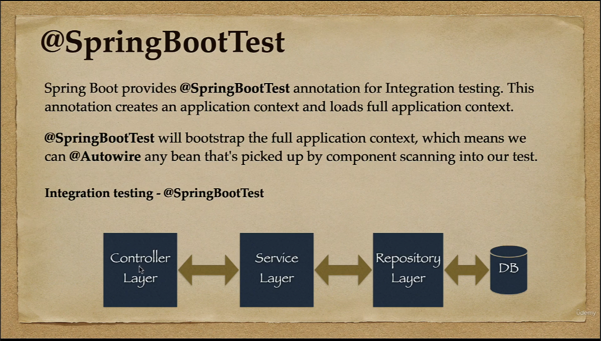

## Do curso de Testing da Udemy
### ministrado por Java Guides

### Testes de integração
Os testes de integração são focados em, como o nome sugere, testar a relação entre diferentes camadas da aplicação que sejam dependentes entre si. Qual seja: não se utiliza de Mock em tais testes.

Os Unit testes são utilizados para testar as camadas uma a uma, o Integration Test é utilizado para testar o fluxo completo da aplicação.

A anotação utilizada em testes de integração é a *@SpringBootTest*.

Os testes são utilizados conforme o FEATURE que se deseja testar. Cada feature envolvendo a integração de componentes múltimos: E.g.:   
**Gerenciamento de Aluno**: AlunoRepository, AlunoService, AlunoController.  
**Login**: LoginRepository, LoginService, LoginController.  
**Gerenciamento de Usuário**: UsuarioRepository, UsuarioService, UsuarioController.

### @SpringBootTest

Anotação que cria e carrega todo contexto da aplicação. 

A anotação carrega todos os Beans de todas as camadas da aplicação, permitindo que possamos realizar o teste de integração.

Por trás dos panos, o *@SpringBootTest* inicia o servidor, cria o ambiente Web e habilita a anotação *@Test* a realizar os testes de integração.

Por padrão, a anotação *@SpringBootTest* **não inicia o servidor**. Precisamos configurar o webEnvironment para que seja determinado em que contexto o teste será executado.

Para tal, temos diversas opções:

MOCK(default): Carrega um web ApplicationContext e disponibiliza um Mock de um ambiente web.  
RANDOM_PORT: Carrega o WebServerApplicationContext e disponibiliza um ambiente web real. O servidor embutido é iniciado em uma porta aleatória. **Esta é a opção que deve ser utilizada em testes de integração.** 
DEFINED_PORT: Carrega o WebServerApplicationContext e disponibiliza um ambiente web real.  
NONE: Carrega o ApplicationContext por meio do SpringApplication, mas não disponibiliza ambiente web algum.
